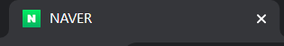
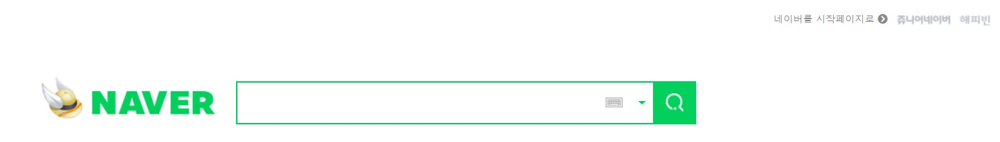

# 네이버 클론코딩
## 클론코딩이란?
말 그대로 **클론**하는 **코딩**으로, 주로 웹 개발에서 쓰이는 용어이며 인스타그램, 카카오톡, 에어비앤비, 유튜브, 넷플릭스 등 우리가 자주 사용하는 서비스나 웹사이트를 밑바닥부터 만들어가는 강의를 의미한다. 이후 이야기하는 클론 코딩은 클론 코딩 강의를 의미한다.   

첫번째로 도전하는 html와 css를 사용하여 네이버 사이트 만들기 즉, 네이버 클론코딩을 만들게 되었다.

```html
<!doctype html>
<html lang="en">
<head>
  <meta charset="utf-8" />
  <title>NAVER</title>
  <link rel="shortcut icon" type="image/x-icon" href="./favicon.ico" />
  <link rel="stylesheet" href="./webfont.css">
  <link rel="stylesheet" href="./footer.css">
  <link rel="stylesheet" href="./global.css">
  <link rel="stylesheet" href="./naver.css">
  <link rel="stylesheet" href="https://use.fontawesome.com/releases/v5.5.0/css/all.css">
  <link rel="stylesheet" href="https://maxcdn.bootstrapcdn.com/font-awesome/4.7.0/css/font-awesome.min.css">  

</head>
```
👉head   
title에는 NAVER로 입력하고 앞에 네이버 이모티콘을 넣어서 사용하게 했다.
    
그 후, 폰트 꾸미기 webfont.css, 공지사항을 footer.css, 공통으로 꾸미는 global.css, 네이버를 만드는 naver.css를 link 태그를 통해 연결해 주었다.   


👉body 중 header   
header부분에는 사진처럼 네이버 시작페이지, 쥬니어네이버, 해피빈과 검색창으로 레이아웃을 했다.
   

먼저, 네이버를 시작페이지, 쥬니어네이버, 해피빈을 보면
```html
<body>
  <header>
    <div class="center-align"> 
      <div id="header-top">
        
        <a href="https://help.naver.com/support/contents/contents.help?serviceNo=1074&categoryNo=16719&from=alias"><span style="margin-right:10px;font-weight: bold;">네이버를 시작페이지로 <i class="fas fa-chevron-circle-right "></i> </span></a>
        <a href="https://jr.naver.com/"></a>
        <a href="https://happybean.naver.com/"></a>
      </div>
        
```
```<header>``` 부분에는 center-align를 class로 전체를 감싸고 header-top으로 네이버를 시작페이지로, 쥬니어네이버, 해피빈을 만들어주었다.    
👉 먼저, 네이버를 시작페이지는 href로 클릭하면 사이트로 넘어갈 수 있게 링크를 써주었고 한글로 "네이버를 시작페이지로" 작성하고 오른쪽 가리키는 아이콘을 설정해주었다.   
쥬니어네이버와 해피빈은 마우스를 가르킬 때, 흑백이었던게 색깔로 입혀지는 효과를 사용하였다. onmouseover를 사용하면 색깔이 바뀌는 것을 확인할 수 있다.   


css로는 
```css
.center-align {
    margin: 0 auto;
    width: 1080px;
}
```
전체 header를 크기 조정을 하였고,   
```css
header {
    height: 170px;
    border-top: 1px solid rgb(204, 195, 195);
}

#header-top {
    float: right;
    margin-top: 5px;
    
}
```
header-top으로 오른쪽 정렬을 해주었다.
```css
#header-top span {
    margin-top: 17px;
    float: left;
    color: #888;
    letter-spacing: -1px;
    font-size: 11px;
    line-height: 10px;
    margin-bottom: 30px;
    margin-right:150px;
    height: 0px;
    
}
```
이 부분은 시작페이지를 가르키는데 쥬니어네이버와 해피빈을 나란히 옆으로 정렬하게 꾸며주었다.   

👉다음은, 네이버의 메인인 검색창을 만들어보았다.
```html
<div id="header-search">
        <a href="https://www.naver.com">
          <h1>
            <span>네이버</span>
          </h1>
        </a>
        <h2 class="blind">검색창</h2>
        <form class="inline-block" action="https://search.naver.com/search.naver?sm=top_hty&fbm=0&ie=utf8&query=">
          <fieldset>
            <legend class="blind">검색</legend>
            <input />
            <span id="search-keyboard"></span>
            <span id="search-history"></span>
            <button type="submit">
              <span class="blind">검색</span>
              <span id="search-image"></span>
            </button>
          </fieldset>
        </form>
      </div>
    </div>
  </header>
```   
h1을 네이버로 설정해 놓았고, h2는 검색창으로 설정해 놓았다.   
여기서 blind class를 만들어서 글자들을 숨길 수 있는 효과를 주는 것이다. css를 보면, ```overflow: hidden```을 써서 넘치는 부분은 잘려서 보여지지 않는 것을 말한다. 
```css
.blind {
    position: absolute;
    overflow: hidden;
    clip: rect(0 0 0 0);
    margin: -1px;
    width: 1px;
    height: 1px;
}
``` 


